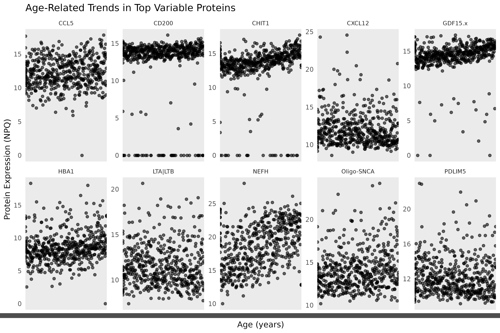
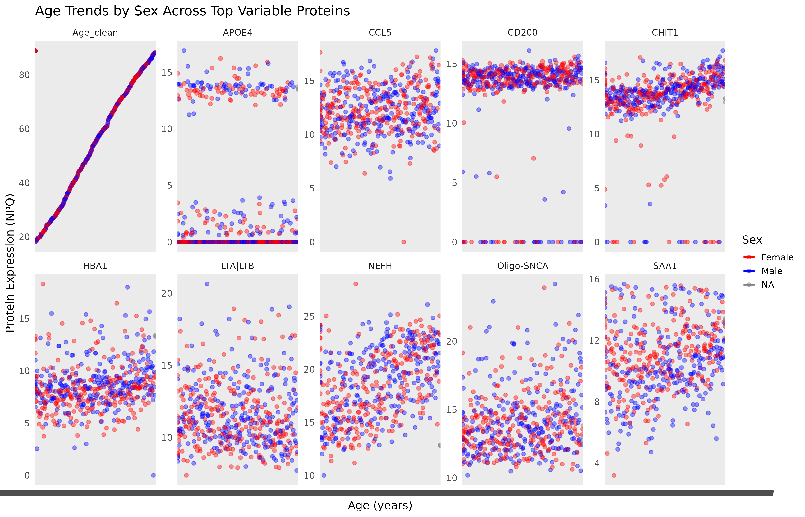
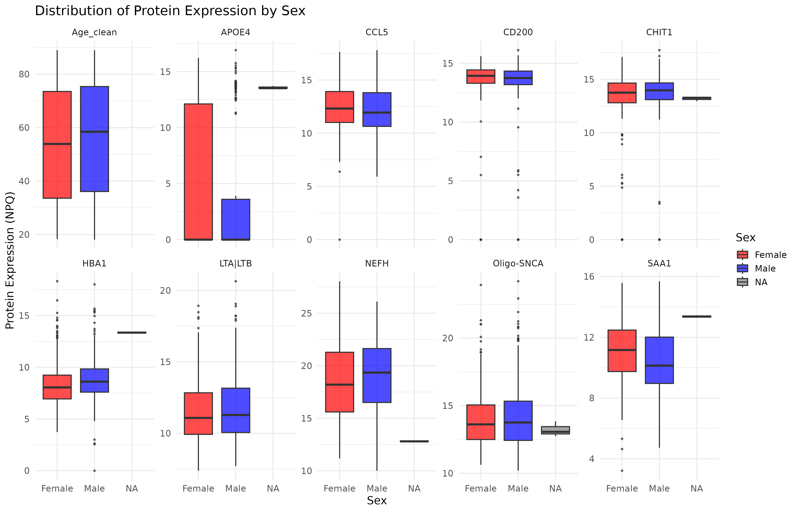
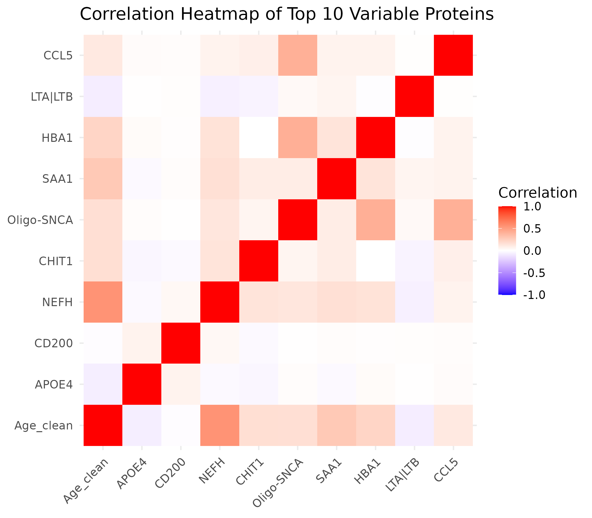
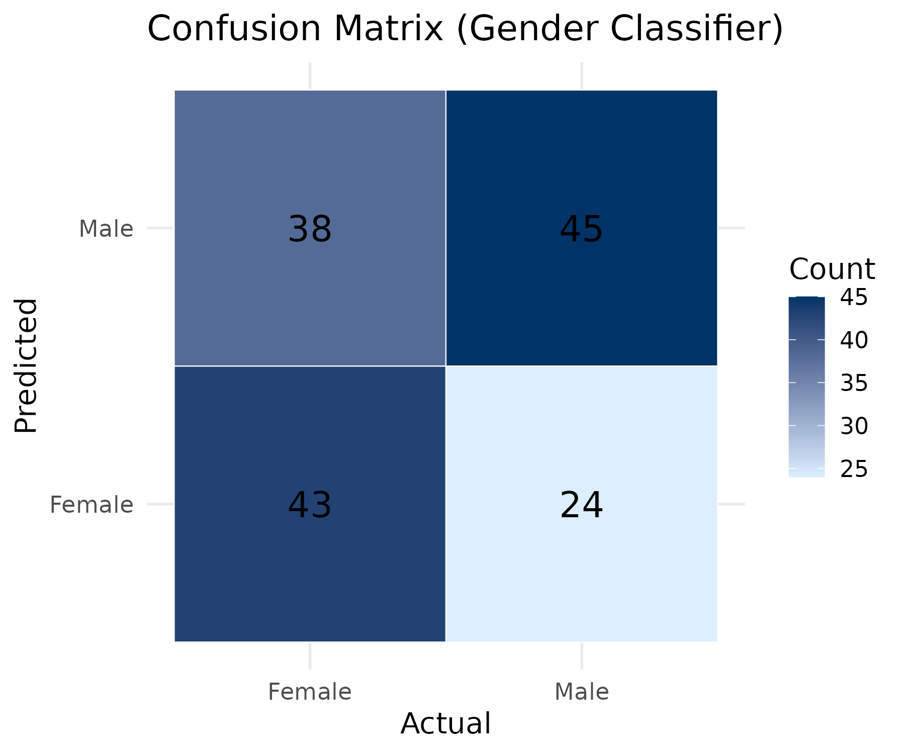

#age trends in protein expression

The plot below visualises how the top variable proteins change with **Age**.

```{r, echo=FALSE, out.width="95%"}

The top proteins show diverse age trajectories, suggesting heterogeneity in biomarker aging patterns.
Sex Differences in Age Trends
This figure shows Age vs NPQ for each protein, coloured by Sex.
Writing


Separate LOESS curves highlight Sex-specific age-related patterns.
Sex-Based Distribution Differences
This boxplot compares Male vs Female NPQ levels across proteins.
Writing


Many proteins display visible shifts between sexes.
Protein–Protein Correlation Structure
Correlation among the top variable proteins is shown below.
Writing


Certain proteins cluster strongly together, suggesting shared pathways or assay behavior.
Logistic Regression Classifier
A logistic regression classifier was trained to predict Sex from the top 10 proteins.
Performance is shown in the confusion matrix below:
Writing


Accuracy was computed as the proportion of correctly predicted labels.
Summary
This project demonstrates a complete biological data analysis pipeline:
Cleaning & merging multiple assay datasets
Identifying high-variance proteins
Visualizing age and sex differences
Correlation analysis
Logistic classifier modeling
Automated reproducibility using Makefile + Docker
Running:
make
regenerates the entire project 

This report was generated with:
rmarkdown::render("report.Rmd", output_format = "pdf_document")
inside a Docker container defined in the provided Dockerfile.